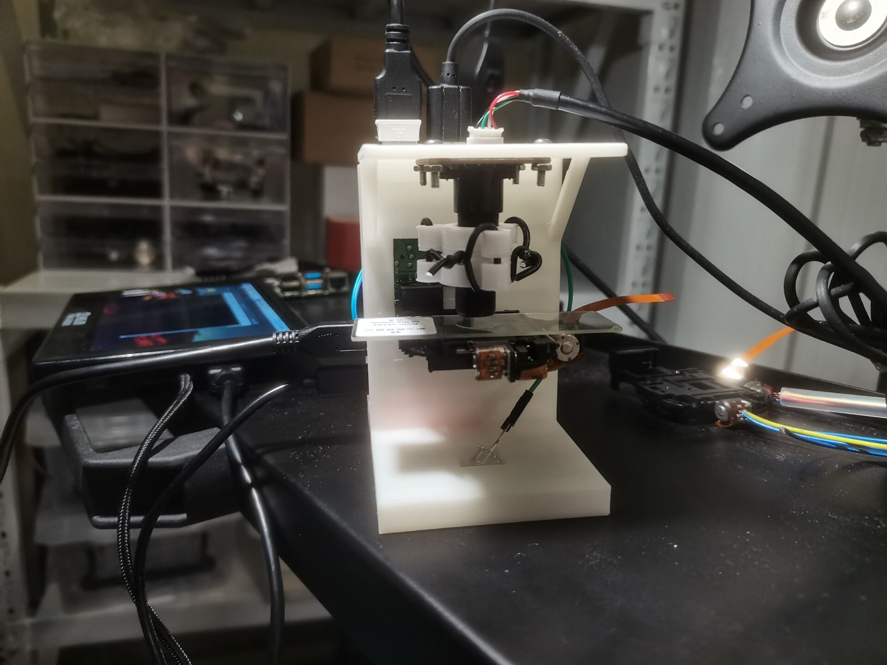
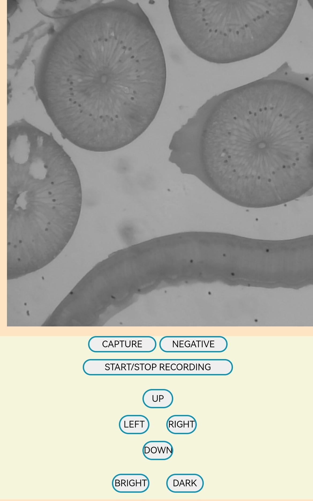

# **Intellgent-Microscope-Mini**

*************

这是一门利用3D打印、树莓派等来制作一台智能显微镜的课程。

受限于硬件资源，软件部分带有yolo-v4 tiny目标识别的tr_version在树莓派上并不可流畅运行，而based_version则可以流畅运行。

声明：

软件部分源代码借鉴了如下项目并进行了一定调整：

[项目1](https://github.com/hemanth-nag/Camera_Flask_App)  [项目2](https://github.com/DataXujing/OpenCV-Flask)  

硬件部分及树莓派控制的软件部分在此也仅是引用，感谢Y同学、C同学及X同学

最终成果：

